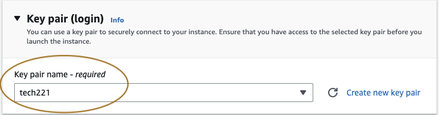
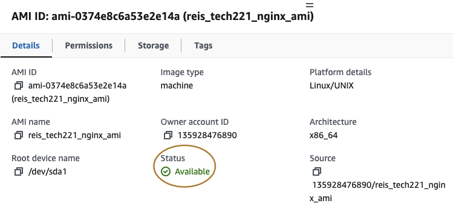
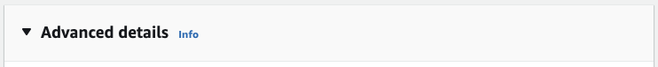
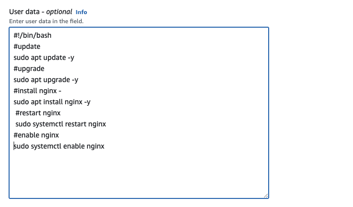
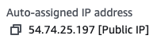
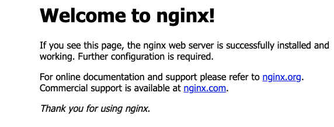

# Amazon machine image

- a way of storing previous instances created on AWS, allows you to 
make iterations in development of instances, but these AMIs are immutable.

### How to create an AMI

Navigate to your instance and select it, click actions, 
image and templates, create image. 

Add image name and desc, it is good practice to use a good naming convention
for this and to add a description of the image so if someone new
were to use it they do details about it.

You will be presented with alot of the options you were given when you first created the 
instance, the OS image will be selected for you.

You will need to add the key pair to allow you to access the instance.

Within network settings, you can either select security group you have previously made
or decide to create a new one, in this case we chose an existing one.

Optional to change size, add volumes and add tags, click "create image".

### How to access and Launch AMI

navigate to images section and select ami's. 

Once you have located your AMI, you can add a name/tag by hovering over
name and select to edit 

Before we can launch our AMI, we need to make sure the status is "Available".

Now, all that's left to do is Launch the instance from our AMI.

### How to access and share AMI 

Connect to instance and follow aws prompts and see previous readme for more documentation

Moving to our Git Bash window, if we enter this command, we will be asked 
to log in using ubuntu and not root, meaning we need to run the 
same command replacing "root" with ubuntu.

A welcome message will show you have accessed this image.
It's important to note that you can also make AMI's to sell or use ones being sold
on the AMI catalog.

### IAM identity access management - LPA (the least privileged access - Need to now Basis)

Create accounts for others, grant and deny permissions depending on personal,
account management.

- navigate to IAM dashboard
- search for the user you want to check their permissions

#### to add new policy 

- search for the policy and request for the permission

### Automate with user data

To Have an automated script run as soon as we launch our instance,
We need to build our instance as we have previously, but before launching.

If we scroll to the bottom of the instance settings and go to "Advanced settings", 
at the bottom of this there is an option to input user date, from this point
we can input of shell file script, and launch our instance.

To check if this has been successful we can copy the instance IP in our browser

You should be met with this screen:

This confirms our automation script was successfully run when initialising our instance.

### Create environment variable in Linux

We do this to hide information like passwords, keys, etc

- `printenv` or `env` - shows all variables in the environment

- `printenv "variable_name` - shows certain variable in env, if doesnt show the variable doesnt exist.

- `"variable_name"="variable` - to create a variable in Linux

- `echo $"variable_name"` - will return variable if it exists

- `export LAST_NAME=pinnock` - creates an environment variable but only while you are in the environment

- `ls -a` - shows all files even hidden files.

.bashrc file holds all persistent variables - `sudo nano .bashrc` helps us write these
new variables into the environment 

we need to refresh the file using `source .bashrc`, now using `printenv "variable_name` we can 
see if the variable becomes persistent. 

